# GRIN

[](https://travis-ci.org/grin-compiler/grin) [](https://coveralls.io/github/grin-compiler/grin?branch=master)
[](https://gitter.im/Grin-Development/Lobby)

The name GRIN is short for *Graph Reduction Intermediate Notation*, and it is an intermediate language for graph reduction. GRIN is the optimizer and code generator component of the GRIN Compiler project which includes language frontends for *Haskell*, *Idris* and *Agda*.
To get the big picture of the project check the [project website](https://grin-compiler.github.io/).
For an overview of the optimizer read
<a href="http://nbviewer.jupyter.org/github/grin-compiler/grin/blob/master/papers/The GRIN Project.pdf">
The GRIN Project
</a> paper. To grasp the details take your time and read Urban Boquist's PhD thesis on
<a href="http://nbviewer.jupyter.org/github/grin-compiler/grin/blob/master/papers/boquist.pdf">
Code Optimisation Techniques for Lazy Functional Languages
</a>.

We presented the core ideas of GRIN at Haskell Exchange 2018. [slides](https://docs.google.com/presentation/d/1QsZ3Kyy3XIco-qba1biRmzuMzz8o2uCBqA9DMtnqP2c/edit?usp=sharing) [video](https://skillsmatter.com/skillscasts/12390-grin-an-alternative-haskell-compiler-backend)

Read our paper [A modern look at GRIN, an optimizing functional language back end](https://nbviewer.jupyter.org/github/Anabra/grin/blob/65177587f4ea0586801e582f1f3750b2d46351a2/papers/stcs-2019/article/tex/main.pdf) (2019) to get an overview of GRIN related projects and other whole program compilers i.e. *Boquist GRIN, UHC, JHC, LHC, HRC, MLton*

Also check the GRIN transformation [example from Boquist PhD](http://nbviewer.jupyter.org/github/grin-compiler/grin/blob/master/papers/boquist.pdf#page=317) and an [example from our implementation](https://github.com/grin-compiler/grin/tree/master/grin/grin/sum-simple-output).

## Support

The project is supported by these awesome [backers](https://github.com/grin-compiler/grin/blob/master/BACKERS.md). Special thanks to our gold sponsor:
### *Sam Griffin*

If you'd like to join them, please consider become a backer or sponsor on [Patreon](https://www.patreon.com/csaba_hruska).  

<a href="https://www.patreon.com/csaba_hruska">

</a>

## GRIN IR

<a href="http://nbviewer.jupyter.org/github/grin-compiler/grin/blob/master/papers/boquist.pdf#page=41">

</a>

## Showcase


## Setup

### Installing LLVM

#### Homebrew

Example using Homebrew on macOS:

```bash
$ brew install llvm-hs/llvm/llvm-7
```

#### Debian/Ubuntu

For Debian/Ubuntu based Linux distributions, the LLVM.org website provides
binary distribution packages. Check [apt.llvm.org](http://apt.llvm.org/) for
instructions for adding the correct package database for your OS version, and
then:

```bash
$ apt-get install llvm-7-dev
```

#### Nix

To get a nix shell with all the required dependencies do the following in the top level folder.

```
nix-shell
```

To run the example do the following from the top level folder.

```
(cd grin; cabal run grin -- grin/opt-stages-high-level/stage-00.grin)
```

To run a local Hoogle server with Haskell documentation do the following.

```
hoogle server --port 8087 1>/dev/null 2>/dev/null&
```

### Build GRIN

```
stack setup
stack build
```

### Usage

```
stack exec -- grin grin/grin/opt-stages-high-level/stage-00.grin
```
## How to Contribute
See: [Issues / Tasks for new contributors](https://github.com/grin-compiler/grin/issues/3)
Keep it simple: We follow the fundamentals laid down in [HaskellerZ - Feb 2018 - Getting things done in Haskell](https://www.youtube.com/watch?v=-X1vrxQUETM)

## Example Front-End

Read about how to <a href="http://nbviewer.jupyter.org/github/grin-compiler/grin/blob/master/papers/boquist.pdf#page=64">generate GRIN code</a> from a frontend language.

Also check the corresponding [source code](https://github.com/grin-compiler/ghc-grin/tree/master/lambda-grin/src/Lambda).

i.e.
- [Lambda/Syntax.hs](https://github.com/grin-compiler/ghc-grin/tree/master/lambda-grin/src/Lambda/Syntax.hs) - front-end language defintion
- [Lambda/GrinCodeGenBoxed.hs](https://github.com/grin-compiler/ghc-grin/tree/master/lambda-grin/src/Lambda/GrinCodeGenBoxed.hs) - code generator from front-end language to grin


## Simplifying Transformations

Transformation | Schema
-------------- | ------
[vectorisation][113]                <br><br> _source code:_ <br> [Vectorisation2.hs]       | [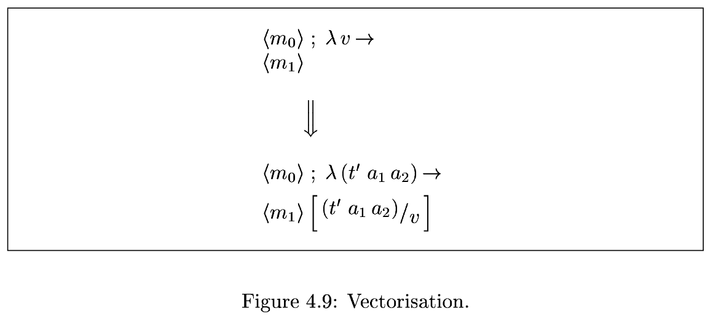][113]
[case simplification][116]          <br><br> _source code:_ <br> [CaseSimplification.hs]   | [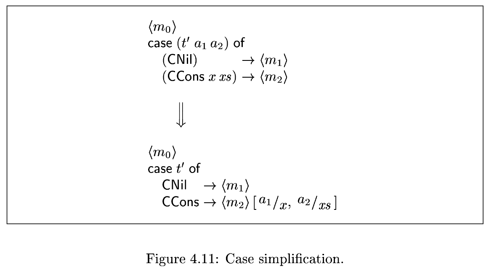][116]
[split fetch operation][118]        <br><br> _source code:_ <br> [SplitFetch.hs]           | [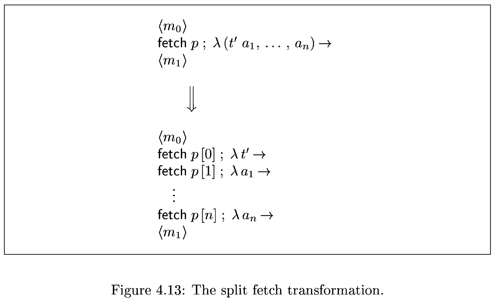][118]
[right hoist fetch operation][123]  <br><br> _source code:_ <br> [RightHoistFetch2.hs]     | [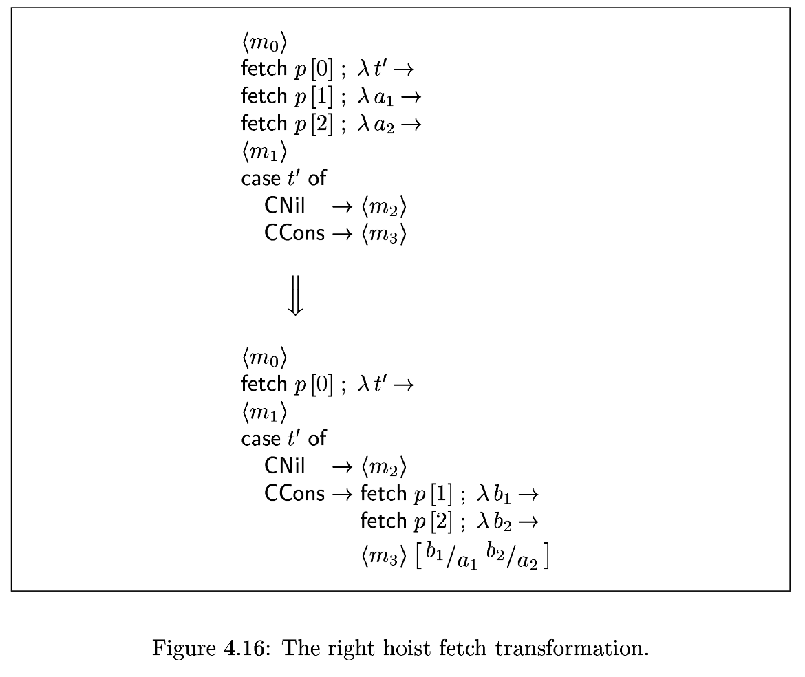][123]
[register introduction][126]        <br><br> _source code:_ <br> [RegisterIntroduction.hs] | [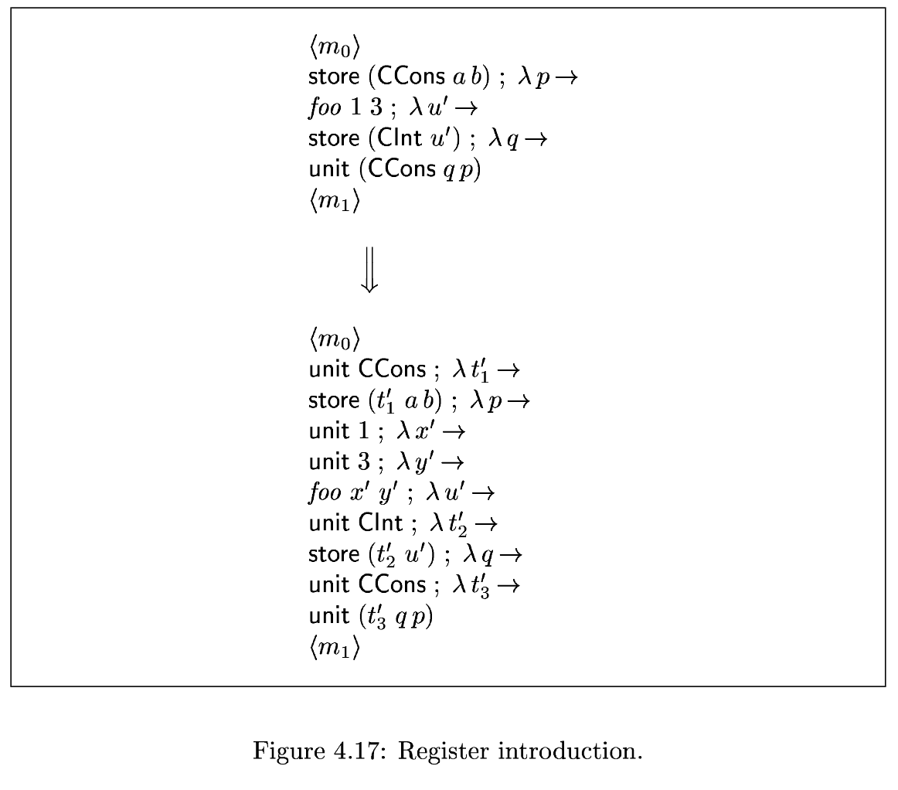][126]


[113]: http://nbviewer.jupyter.org/github/grin-compiler/grin/blob/master/papers/boquist.pdf#page=113
[116]: http://nbviewer.jupyter.org/github/grin-compiler/grin/blob/master/papers/boquist.pdf#page=116
[118]: http://nbviewer.jupyter.org/github/grin-compiler/grin/blob/master/papers/boquist.pdf#page=118
[123]: http://nbviewer.jupyter.org/github/grin-compiler/grin/blob/master/papers/boquist.pdf#page=123
[126]: http://nbviewer.jupyter.org/github/grin-compiler/grin/blob/master/papers/boquist.pdf#page=126

[Vectorisation2.hs]:        https://github.com/grin-compiler/grin/blob/master/grin/src/Transformations/Simplifying/Vectorisation2.hs
[CaseSimplification.hs]:    https://github.com/grin-compiler/grin/blob/master/grin/src/Transformations/Simplifying/CaseSimplification.hs
[SplitFetch.hs]:            https://github.com/grin-compiler/grin/blob/master/grin/src/Transformations/Simplifying/SplitFetch.hs
[RightHoistFetch2.hs]:      https://github.com/grin-compiler/grin/blob/master/grin/src/Transformations/Simplifying/RightHoistFetch2.hs
[RegisterIntroduction.hs]:  https://github.com/grin-compiler/grin/blob/master/grin/src/Transformations/Simplifying/RegisterIntroduction.hs


## Optimising Transformations

Transformation | Schema
-------------- | ------
[evaluated case elimination][141]         <br><br> _source code:_ <br> [EvaluatedCaseElimination.hs] <br><br> _test:_ <br> [EvaluatedCaseEliminationSpec.hs]  | [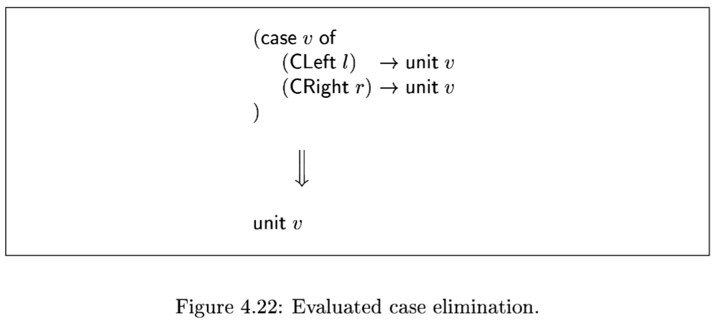][141]
[trivial case elimination][142]           <br><br> _source code:_ <br> [TrivialCaseElimination.hs]   <br><br> _test:_ <br> [TrivialCaseEliminationSpec.hs]    | [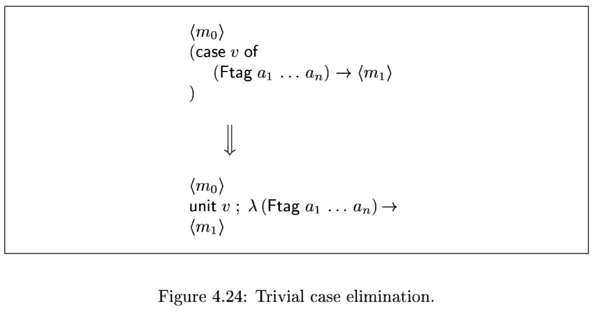][142]
[sparse case optimisation][143]           <br><br> _source code:_ <br> [SparseCaseOptimisation.hs]   <br><br> _test:_ <br> [SparseCaseOptimisationSpec.hs]    | [][143]
[update elimination][148]                 <br><br> _source code:_ <br> [UpdateElimination.hs]        <br><br> _test:_ <br> [UpdateEliminationSpec.hs]         | [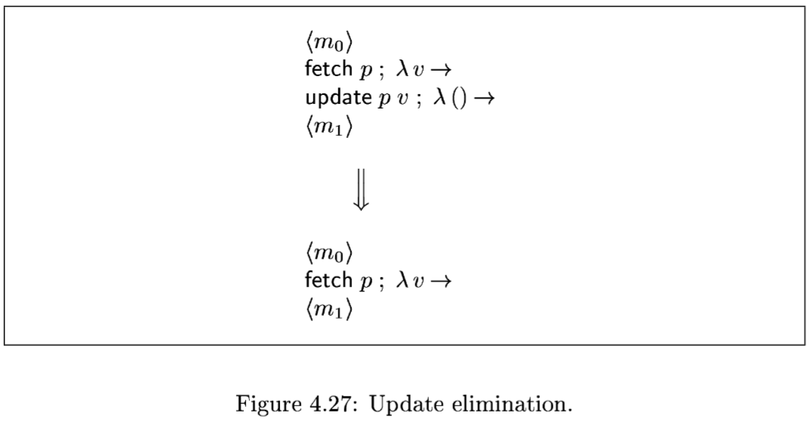][148]
[copy propagation][129]                   <br><br> _source code:_ <br> [CopyPropagation.hs]          <br><br> _test:_ <br> [CopyPropagationSpec.hs]           | [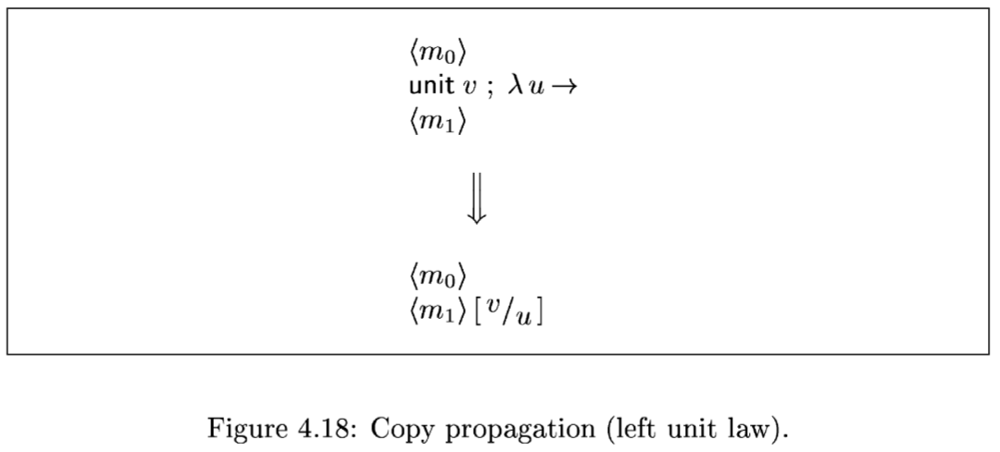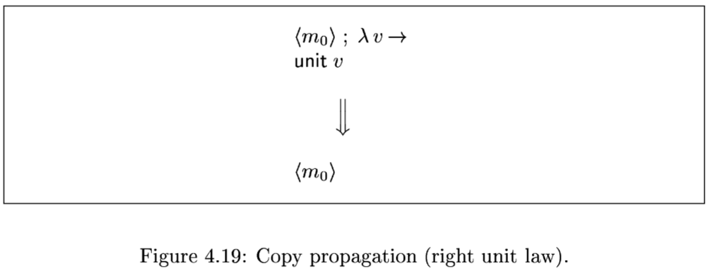][129]
[late inlining][151]                      <br><br> _source code:_ <br> [Inlining.hs]                 <br><br> _test:_ <br> [InliningSpec.hs]                  | [][151]
[generalised unboxing][134]               <br><br> _source code:_ <br> [GeneralizedUnboxing.hs]      <br><br> _test:_ <br> [GeneralizedUnboxingSpec.hs]       | [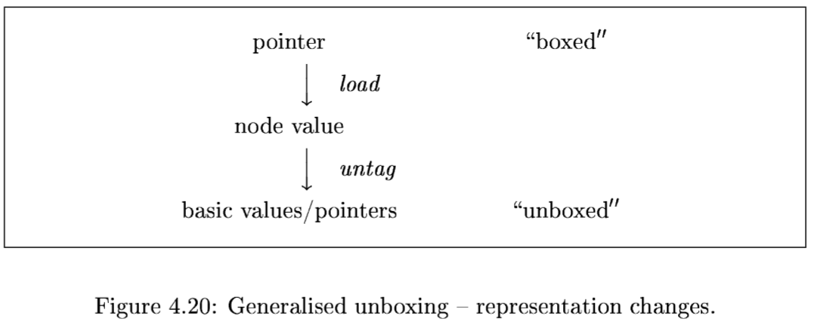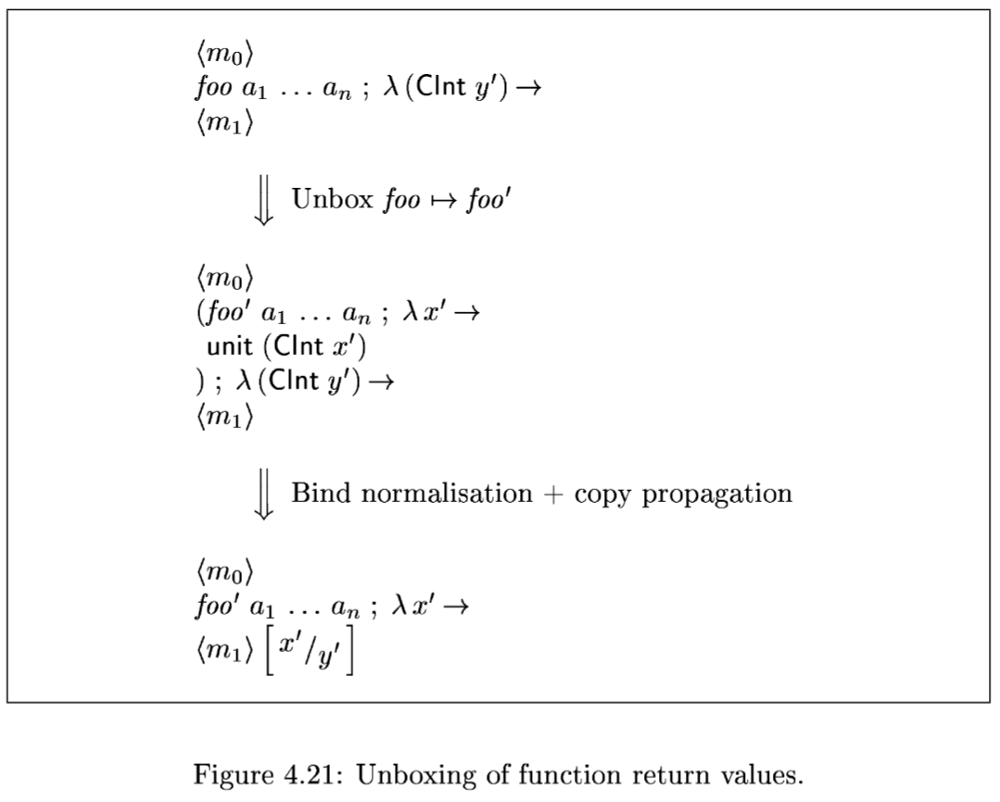][134]
[arity raising][160]                      <br><br> _source code:_ <br> [ArityRaising.hs]             <br><br> _test:_ <br> [ArityRaisingSpec.hs]              | [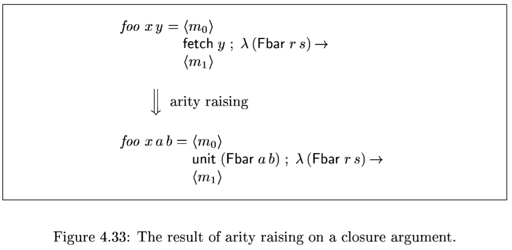][160]
[case copy propagation][144]              <br><br> _source code:_ <br> [CaseCopyPropagation.hs]      <br><br> _test:_ <br> [CaseCopyPropagationSpec.hs]       | [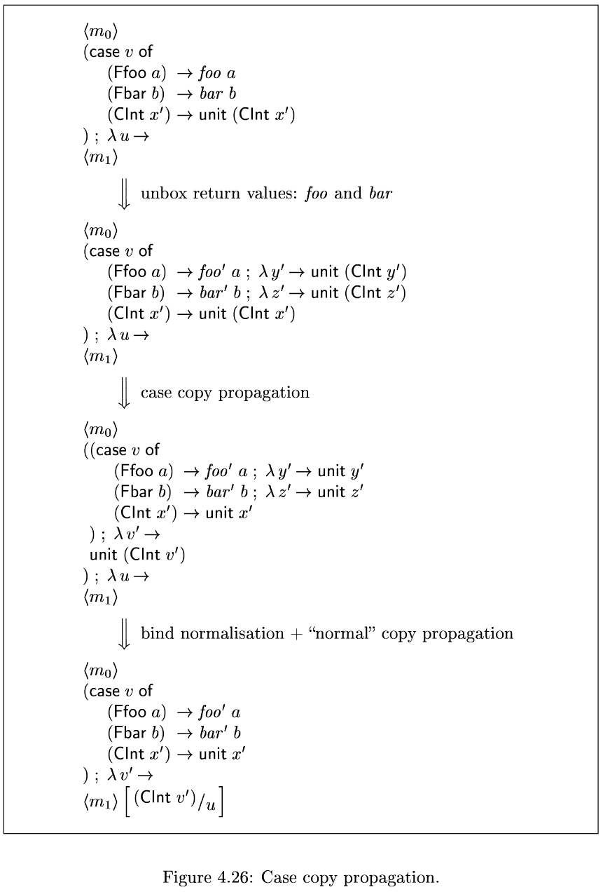][144]
[case hoisting][153]                      <br><br> _source code:_ <br> [CaseHoisting.hs]             <br><br> _test:_ <br> [CaseHoistingSpec.hs]              | [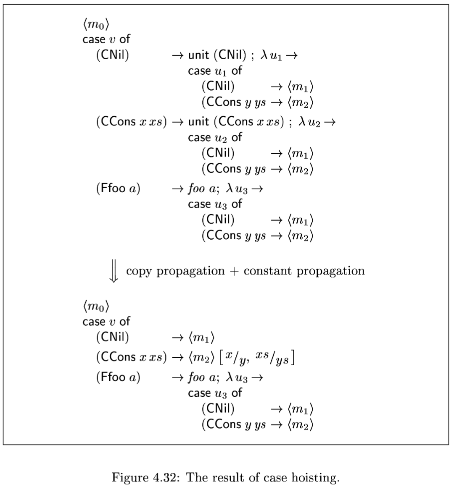][153]
[whnf update elimination][149]            <br><br> _source code:_ <br> __TODO__                      <br><br> _test:_ <br> __TODO__                           | [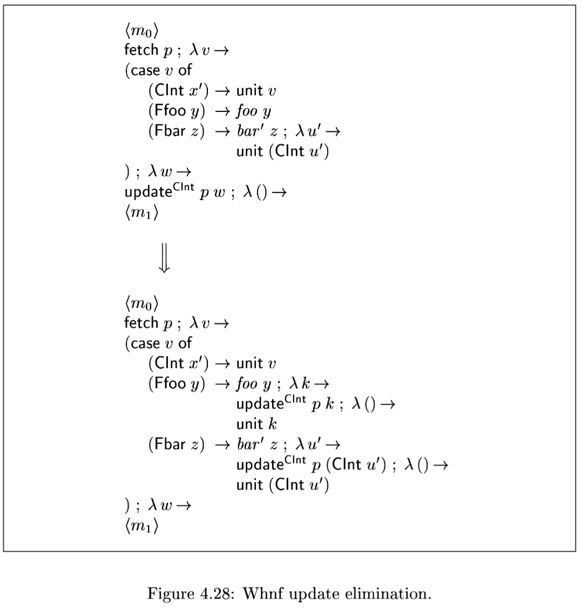][149]
[common sub-expression elimination][164]  <br><br> _source code:_ <br> [CSE.hs]                      <br><br> _test:_ <br> [CSESpec.hs]                       | [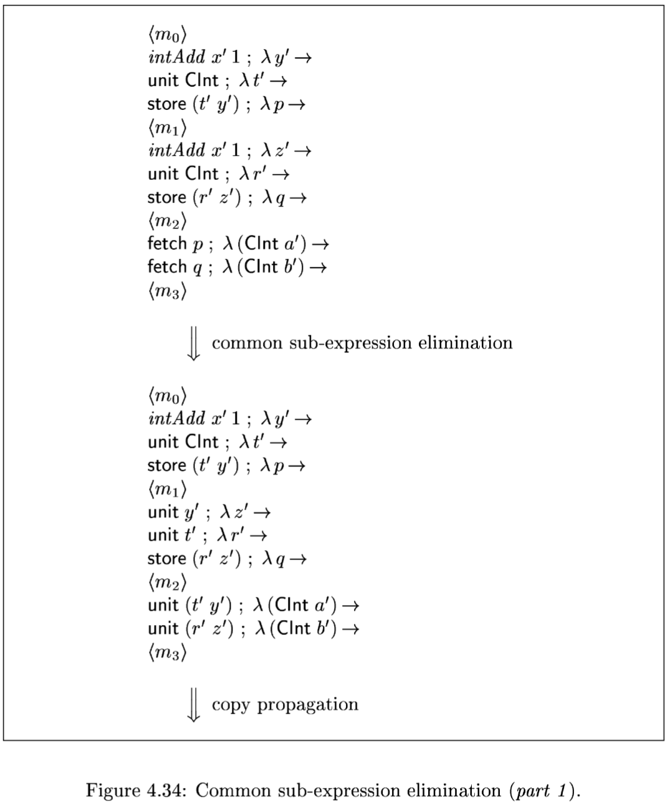][164]
[constant propagation][159]               <br><br> _source code:_ <br> [ConstantPropagation.hs]      <br><br> _test:_ <br> [ConstantPropagationSpec.hs]       |
[dead function elimination][169]          <br><br> _source code:_ <br> [SimpleDeadFunctionElimination.hs]  <br><br> _test:_ <br> [SimpleDeadFunctionEliminationSpec.hs]   |
[dead variable elimination][170]          <br><br> _source code:_ <br> [SimpleDeadVariableElimination.hs]  <br><br> _test:_ <br> [SimpleDeadVariableEliminationSpec.hs]   |
[dead parameter elimination][171]         <br><br> _source code:_ <br> [SimpleDeadParameterElimination.hs] <br><br> _test:_ <br> [SimpleDeadParameterEliminationSpec.hs]  |

[129]: http://nbviewer.jupyter.org/github/grin-compiler/grin/blob/master/papers/boquist.pdf#page=129
[134]: http://nbviewer.jupyter.org/github/grin-compiler/grin/blob/master/papers/boquist.pdf#page=134
[141]: http://nbviewer.jupyter.org/github/grin-compiler/grin/blob/master/papers/boquist.pdf#page=141
[142]: http://nbviewer.jupyter.org/github/grin-compiler/grin/blob/master/papers/boquist.pdf#page=142
[143]: http://nbviewer.jupyter.org/github/grin-compiler/grin/blob/master/papers/boquist.pdf#page=143
[144]: http://nbviewer.jupyter.org/github/grin-compiler/grin/blob/master/papers/boquist.pdf#page=144
[148]: http://nbviewer.jupyter.org/github/grin-compiler/grin/blob/master/papers/boquist.pdf#page=148
[149]: http://nbviewer.jupyter.org/github/grin-compiler/grin/blob/master/papers/boquist.pdf#page=149
[151]: http://nbviewer.jupyter.org/github/grin-compiler/grin/blob/master/papers/boquist.pdf#page=151
[153]: http://nbviewer.jupyter.org/github/grin-compiler/grin/blob/master/papers/boquist.pdf#page=153
[159]: http://nbviewer.jupyter.org/github/grin-compiler/grin/blob/master/papers/boquist.pdf#page=159
[160]: http://nbviewer.jupyter.org/github/grin-compiler/grin/blob/master/papers/boquist.pdf#page=160
[164]: http://nbviewer.jupyter.org/github/grin-compiler/grin/blob/master/papers/boquist.pdf#page=164
[169]: http://nbviewer.jupyter.org/github/grin-compiler/grin/blob/master/papers/boquist.pdf#page=169
[170]: http://nbviewer.jupyter.org/github/grin-compiler/grin/blob/master/papers/boquist.pdf#page=170
[171]: http://nbviewer.jupyter.org/github/grin-compiler/grin/blob/master/papers/boquist.pdf#page=171

[ArityRaising.hs]:              https://github.com/grin-compiler/grin/blob/master/grin/src/Transformations/Optimising/ArityRaising.hs
[ConstantPropagation.hs]:       https://github.com/grin-compiler/grin/blob/master/grin/src/Transformations/Optimising/ConstantPropagation.hs
[CopyPropagation.hs]:           https://github.com/grin-compiler/grin/blob/master/grin/src/Transformations/Optimising/CopyPropagation.hs
[CaseCopyPropagation.hs]:       https://github.com/grin-compiler/grin/blob/master/grin/src/Transformations/Optimising/CaseCopyPropagation.hs
[CaseHoisting.hs]:              https://github.com/grin-compiler/grin/blob/master/grin/src/Transformations/Optimising/CaseHoisting.hs
[CSE.hs]:                       https://github.com/grin-compiler/grin/blob/master/grin/src/Transformations/Optimising/CSE.hs
[EvaluatedCaseElimination.hs]:  https://github.com/grin-compiler/grin/blob/master/grin/src/Transformations/Optimising/EvaluatedCaseElimination.hs
[Inlining.hs]:                  https://github.com/grin-compiler/grin/blob/master/grin/src/Transformations/Optimising/Inlining.hs
[SparseCaseOptimisation.hs]:    https://github.com/grin-compiler/grin/blob/master/grin/src/Transformations/Optimising/SparseCaseOptimisation.hs
[TrivialCaseElimination.hs]:    https://github.com/grin-compiler/grin/blob/master/grin/src/Transformations/Optimising/TrivialCaseElimination.hs
[UpdateElimination.hs]:         https://github.com/grin-compiler/grin/blob/master/grin/src/Transformations/Optimising/UpdateElimination.hs
[GeneralizedUnboxing.hs]:       https://github.com/grin-compiler/grin/blob/master/grin/src/Transformations/Optimising/GeneralizedUnboxing.hs
[SimpleDeadFunctionElimination.hs]:   https://github.com/grin-compiler/grin/blob/master/grin/src/Transformations/Optimising/SimpleDeadFunctionElimination.hs
[SimpleDeadVariableElimination.hs]:   https://github.com/grin-compiler/grin/blob/master/grin/src/Transformations/Optimising/SimpleDeadVariableElimination.hs
[SimpleDeadParameterElimination.hs]:  https://github.com/grin-compiler/grin/blob/master/grin/src/Transformations/Optimising/SimpleDeadParameterElimination.hs

[ArityRaisingSpec.hs]:              https://github.com/grin-compiler/grin/blob/master/grin/test/Transformations/Optimising/ArityRaisingSpec.hs
[ConstantPropagationSpec.hs]:       https://github.com/grin-compiler/grin/blob/master/grin/test/Transformations/Optimising/ConstantPropagationSpec.hs
[CopyPropagationSpec.hs]:           https://github.com/grin-compiler/grin/blob/master/grin/test/Transformations/Optimising/CopyPropagationSpec.hs
[CaseCopyPropagationSpec.hs]:       https://github.com/grin-compiler/grin/blob/master/grin/test/Transformations/Optimising/CaseCopyPropagationSpec.hs
[CaseHoistingSpec.hs]:              https://github.com/grin-compiler/grin/blob/master/grin/test/Transformations/Optimising/CaseHoistingSpec.hs
[CSESpec.hs]:                       https://github.com/grin-compiler/grin/blob/master/grin/test/Transformations/Optimising/CSESpec.hs
[EvaluatedCaseEliminationSpec.hs]:  https://github.com/grin-compiler/grin/blob/master/grin/test/Transformations/Optimising/EvaluatedCaseEliminationSpec.hs
[InliningSpec.hs]:                  https://github.com/grin-compiler/grin/blob/master/grin/test/Transformations/Optimising/InliningSpec.hs
[SparseCaseOptimisationSpec.hs]:    https://github.com/grin-compiler/grin/blob/master/grin/test/Transformations/Optimising/SparseCaseOptimisationSpec.hs
[TrivialCaseEliminationSpec.hs]:    https://github.com/grin-compiler/grin/blob/master/grin/test/Transformations/Optimising/TrivialCaseEliminationSpec.hs
[UpdateEliminationSpec.hs]:         https://github.com/grin-compiler/grin/blob/master/grin/test/Transformations/Optimising/UpdateEliminationSpec.hs
[GeneralizedUnboxingSpec.hs]:       https://github.com/grin-compiler/grin/blob/master/grin/test/Transformations/Optimising/GeneralizedUnboxingSpec.hs
[SimpleDeadFunctionEliminationSpec.hs]:   https://github.com/grin-compiler/grin/blob/master/grin/test/Transformations/Optimising/SimpleDeadFunctionEliminationSpec.hs
[SimpleDeadVariableEliminationSpec.hs]:   https://github.com/grin-compiler/grin/blob/master/grin/test/Transformations/Optimising/SimpleDeadVariableEliminationSpec.hs
[SimpleDeadParameterEliminationSpec.hs]:  https://github.com/grin-compiler/grin/blob/master/grin/test/Transformations/Optimising/SimpleDeadParameterEliminationSpec.hs
